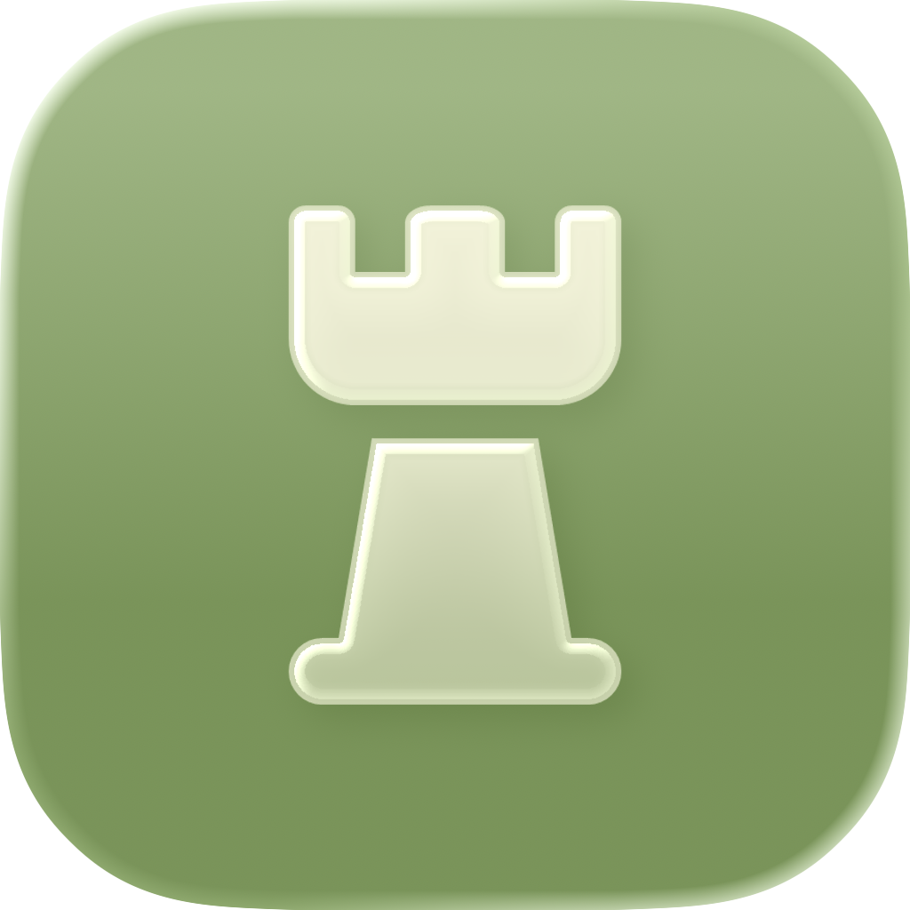

<div align="center">

<picture>
      
</picture>

# chess-vision

A **chessboard** recognition system that takes an image and outputs a [FEN](https://en.wikipedia.org/wiki/Forsyth%E2%80%93Edwards_Notation) string describing the position.

</div>

## ✨ Features

- **End-to-end pipeline** - image in, FEN out.
- **Board detection** - YOLOv8 primary detector with a multi-strategy classical-CV fallback (contour, grid-line, colour-boundary, centre-crop).
- **Piece classification** - MobileNetV3-Small transfer-learned on 13 classes (empty + 6 white + 6 black pieces).
- **FEN validation & correction** - Legality checks (king count, pawn limits, rank constraints) with confidence-based auto-correction.
- **Test-time augmentation** - Optional horizontal-flip TTA for higher accuracy.
- **Debug visualisation** - Annotated board overlay showing per-square predictions.
- **ONNX export** - Ship the classifier for cross-platform deployment.

## 🚀 Quick Start

### 1. Install dependencies

```bash
pip install -r requirements.txt
```

### 2. Train the classifier

```bash
python chess_vision.py train --pieces-root dataset/pieces --epochs 10 --batch-size 128
```

### 3. Recognise an image

```bash
python chess_vision.py recognize --image game.png --weights checkpoints/best_classifier.pt --visualize
```

### 4. Export to ONNX

```bash
python chess_vision.py export --weights checkpoints/best_classifier.pt --output chess_classifier.onnx
```

## ⚙️ CLI Reference

| Command     | Description                                | Key Flags                                                        |
| ----------- | ------------------------------------------ | ---------------------------------------------------------------- |
| `train`     | Train the piece classifier from scratch    | `--pieces-root`, `--epochs`, `--batch-size`, `--lr`, `--resume`  |
| `recognize` | Run inference on an image              | `--image`, `--weights`, `--visualize`, `--tta`, `--save-debug`   |
| `export`    | Export trained model to ONNX               | `--weights`, `--output`                                          |

Run `python chess_vision.py <command> --help` for full details.

## 🏗️ Architecture

```
Image
  │
  ▼
┌──────────────────┐
│   Board Detect   │
│    (YOLO / CV)   │
└────────┬─────────┘
         │
         ▼
┌──────────────────┐
│ Perspective Warp │
│     512 x 512    │
└────────┬─────────┘
         │
         ▼
┌──────────────────┐
│   8 x 8 Grid     │
│    Extraction    │
└────────┬─────────┘
         │  64 squares (64 x 64 px each)
         ▼
┌──────────────────┐
│    MobileNetV3   │
│     Classifier   │
└────────┬─────────┘
         │  13-class softmax
         ▼
┌──────────────────┐
│    FEN Builder   │
│    + Validation  │
└──────────────────┘

```

## 📋 Requirements

- Python ≥ 3.10
- PyTorch ≥ 2.0
- torchvision ≥ 0.15
- OpenCV ≥ 4.8
- NumPy ≥ 1.24
- Pillow ≥ 10.0
- *(Optional)* ultralytics ≥ 8.0 - for YOLOv8 board detection
- *(Optional)* onnx + onnxruntime - for ONNX export

## 📄 License

This project is provided for educational and personal use. The piece image assets originate from [chess.com](https://www.chess.com) and are subject to their terms of use.

